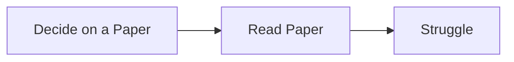

# <i-c src="fas:toilet-paper" size="1.75" style="opacity:0.66;"></i-c> The CRAP System
**C**oding **A**nd **R**eading **P**apers with Plutonium &amp; Patra, so technically it should be CRAPPP or CRAP-PP idk

!> [Click Here for Prod](https://plutoniumm.github.io/CRAP/)

This won't show up if you're reading this on the Hosted Page

## Current Papers
<!-- random papers for sake of format -->
- [ ] [A Survey of Deep Learning Techniques for Graph Classification](https://arxiv.org/abs/1901.00596)
- [ ] [A Survey of Graph Neural Networks](https://arxiv.org/abs/1901.00596)